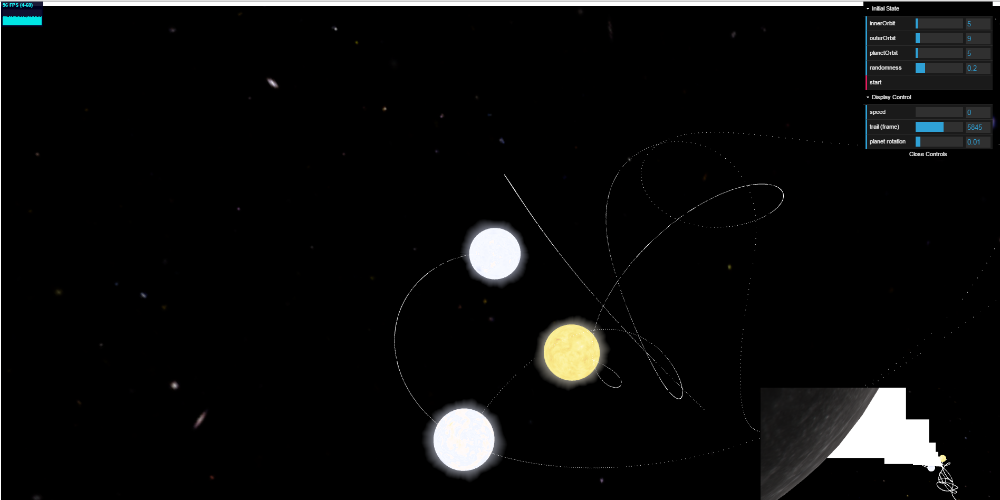
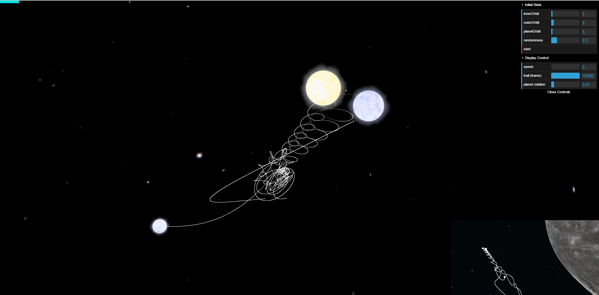
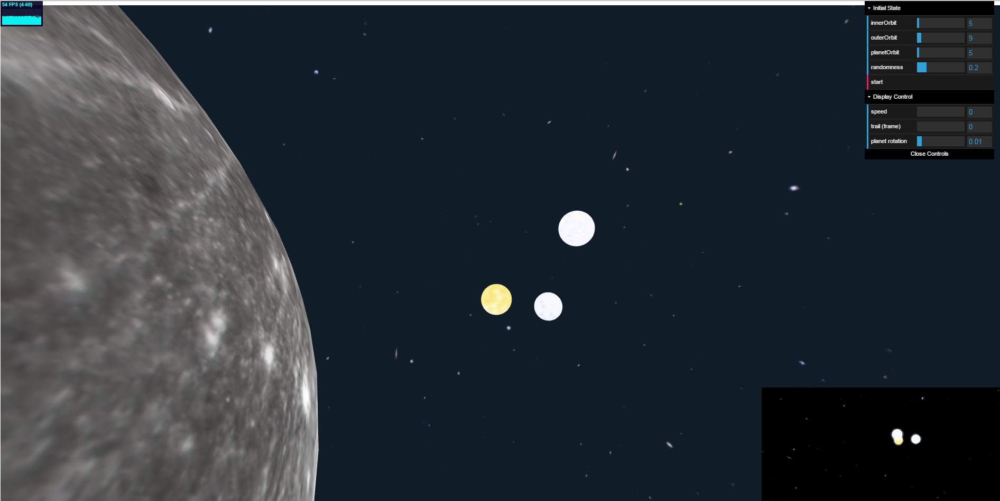
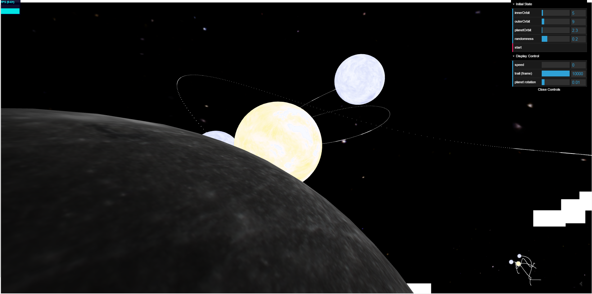

# Three Body

## Links

[demo](http://leav.github.io/three-body/)

[source](https://github.com/leav/three-body)

## Description

This project idea is from the science fiction [*Three Body*][1]. In this simulation, a planet is orbiting around a [triple star system][2], where the planet has three suns. Because of the unpredictable nature of the three body system, chaos things happen, such as one of the sun getting ejected off, or the planet being consumed by the suns.

Inside the simulation, you can set various initial conditions for the star system. Press and drag the mouse to rotate the camera. Use mouse wheel to zoom. Click on the small screen at the right bottom corner to switch between stellar view and planetary view.

To run the demo locally, please refer to [this page](https://github.com/mrdoob/three.js/wiki/How-to-run-things-locally). Otherwise, the security setting of the browser would not let you load the textures.

## Screenshots

### Stellar View

### Planetary View

## Postmortem

### What went well

#### Physics

Physics is the core of every star system simulation. The most challenging part of Physics is to find a right integrating method for the positions and velocities for the stars. At first instinct, I used the [Euler's method][3], which is: new position = old position + velocity, new velocity = old velocity + acceleration. It produced some convincing trajectories at first, but its small errors can quickly add up, as two stars cannot even form a stable orbit in a two body system. The problem of Euler's method is that it assumes the acceleration is constant over the delta time step.

After some researching, I found out that [RK4 integration][4] is the norm in computer science. A [great article][5] by Glenn Fiedler explains the implementation details. Now the interaction between the stars at close distance is more convincing.

#### Class materials

Thankfully for Eric, this project is adopting from the demos through out the class, from the most basic geometries, textures and materials to the more advanced shader programming and double camera viewports.

#### Corona

It uses a noise texture to generate the corona, and you can fine tune the noise texture to control the dynamics of the corona.

### What went wrong

#### Planning

Everything needs to be done in a week in order to enter the class competition. At the start, I had some big ambitions, such as a more mesmerizing planetary view with sky, cloud, ocean, rain and etc. But at the middle of the week, I found myself spending 80% of the time debugging some hopeless [JavaScript][6] and [rotation transforming][7] problems.

#### JavaScript

Sometimes it is too dynamic, as you can summon up an undefined property without getting any errors, the other times it is too cumbersome, for scattering "prototype" and "this" everywhere. And the vector and matrix operations in THREE.js is a bit anti-intuitive because most of them have side effects on the callee, forcing temporary variables even in some basic calculations.

#### Same Origin Policy

[SOP][9] just renders local WebGL programs not being able to dynamically load resources such as textures. [This article][10] is important if you want to run the html page locally.

#### Rotation

Because the project is set in the space, [OrbitAndPanControl][11] would not do the job due to its predefined up and down direction. I fell into several traps when writing the space camera control.

The first trap is the rotation axis. And it is the most time consuming to realize. To make a object rotate around an axis for certain angles, no matter you use Matrix4.makeRotationAxis or Object3D.rotateOnAxis, the axis is in terms of local space instead of the world space. This might seem plainly obvious when written out in words. But the intuition is that something outside rotates the object, so it might feel the axis is in terms of world space. At the end I used an alternate solution, by rotating the scene instead of the camera. It is described in [this article][12]. But this approach introduces some difficulties on objects such as lensFlare, which is another topic later.

The second trap is related to the side effects in matrix operations previously mentioned. For an operation as easy as getting the inverse, you need a temporary variable to do it:

> var m1 = new THREE.Matrix4().makeRotationAxis(new THREE.Vector3(1, 0, 1), Math.PI / 3);
var m2 = new THREE.Matrix4().copy(m1);
m1.getInverse(m1);
var m3 = new THREE.Matrix4();
m3.getInverse(m2);
// m3 is the corrent inverse, m1 is not!

### What could be done

a moon

drinking bird on planet

## Credits

sun texture: [NASA][13]

space texture: [NASA][14]

planet texture (Mercury): [NASA][15]

  [1]: http://en.wikipedia.org/wiki/Three_Body_%28science_fiction%29 "wikipedia: Three Body"
  [2]: https://en.wikipedia.org/wiki/Multiple_star#Triple_star_systems
  [3]: https://en.wikipedia.org/wiki/Euler_method
  [4]: http://en.wikipedia.org/wiki/Runge%E2%80%93Kutta_methods
  [5]: http://gafferongames.com/game-physics/integration-basics/
  [6]: http://stackoverflow.com/questions/387707/whats-the-best-way-to-define-a-class-in-javascript
  [7]: http://threejs.org/docs/58/#Reference/Math/Quaternion
  [8]: http://www.ruby-lang.org/en/
  [9]: http://en.wikipedia.org/wiki/Same_origin_policy
  [10]: https://github.com/mrdoob/three.js/wiki/How-to-run-things-locally
  [11]: https://github.com/udacity/cs291/blob/27488519b3ac41d837d7bde8b11e151af1e3969d/lib/OrbitAndPanControls.js
  [12]: http://www.html5rocks.com/en/tutorials/casestudies/100000stars/
  [13]: http://www.nasa.gov
  [14]: http://www.nasa.gov
  [15]: http://www.nasa.gov